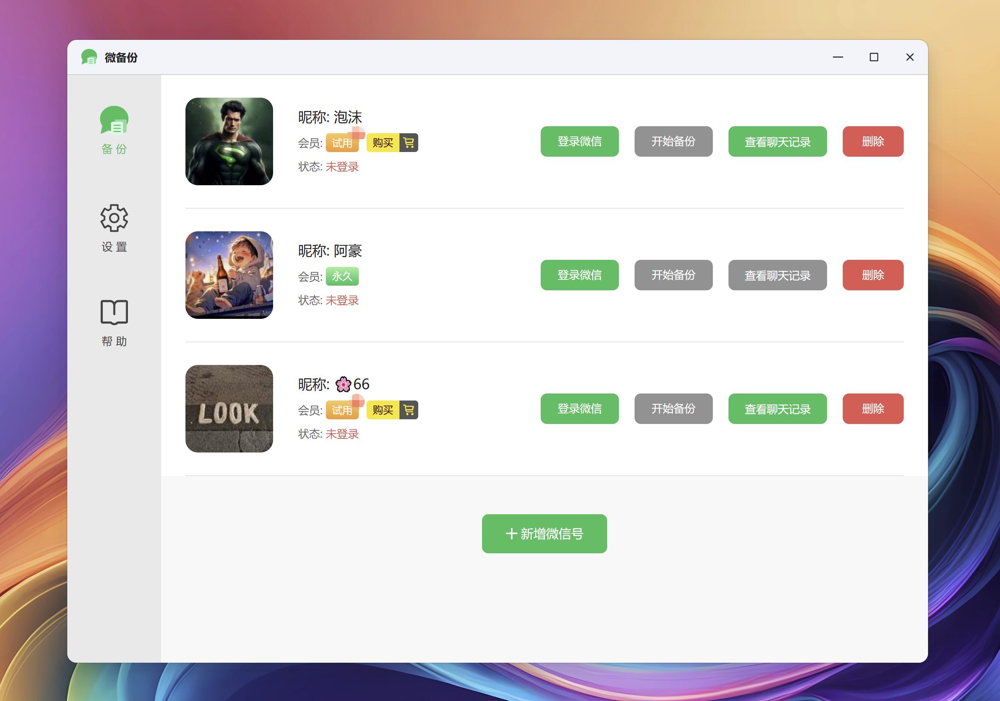
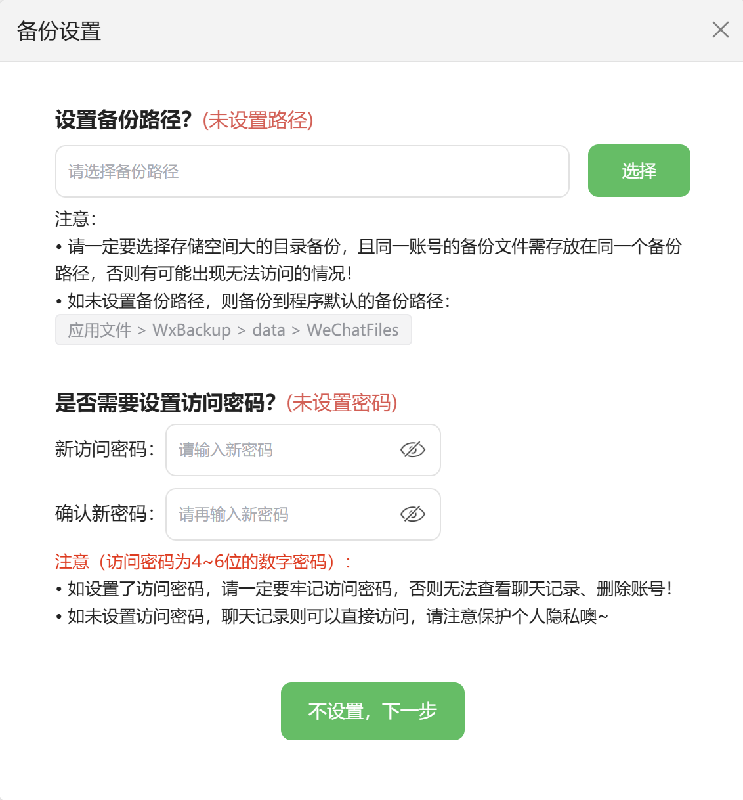
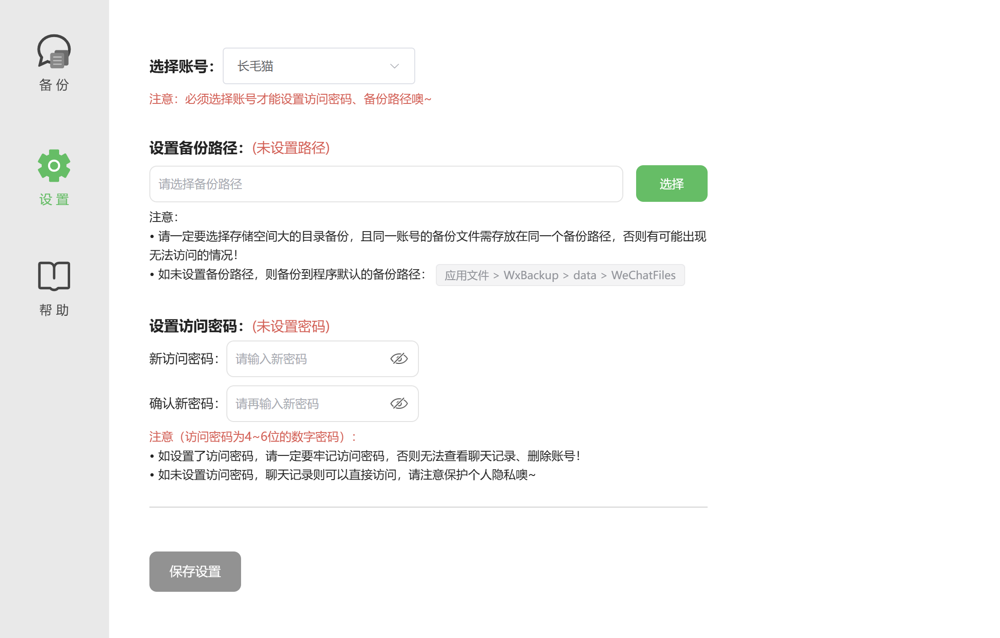
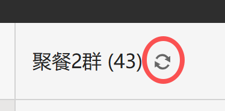

## 介绍：什么是微备份（WxBackup）？

微备份（WxBackup）是一款可用于Nas的微信聊天记录备份软件，无需越狱、Root，即可将苹果、安卓设备 **（暂时不支持鸿蒙系统、鸿蒙微信）** 的微信聊天记录备份至Nas设备，然后通过浏览器（或Nas应用）可对其进行访问，像正常使用微信一样浏览聊天内容和搜索内容。

**以下是微备份Web端的部分界面截图：**




**以下是微备份H5端的部分界面截图：**


### 微备份（WxBackup）的优势

为什么不使用微信自带的备份功能呢？相比微信自带备份，微备份（WxBackup）的核心优势的体现在以下几点：

1. **访问方便**：界面简洁，操作方便，只需简单几步即可备份至Nas，可通过浏览器或其他Nas应用即可在电脑端、手机端查看聊天记录，首次使用web登录后，后续均可在手机端进行操作，例如直接在手机端登录、备份。
2. **支持Nas**：无需越狱、Root即可将聊天记录备份至Nas设备，目前已支持飞牛OS，后续会支持更多的主流平台。
3. **支持多账号**：支持多个微信账号备份聊天记录。
4. **离线查看**：在备份聊天记录后，可脱离微信登录依赖，即使微信未登录或账号被风控，也不影响查看已备份的聊天记录。
5. **数据安全**：备份的聊天记录仅存储在自己的Nas设备中，实现长久保存，备份后支持离线运行，且微备份（WxBackup）不会向任何其他平台传输数据。
6. **支持恢复聊天记录**：可使用Windows端的微信进行恢复已备份的聊天记录（文档最后有恢复教程）。
7. **支持更多丰富的功能**：聊天记录可设置密码访问、导出数据（开发中）、聊天数据统计（开发中）、其他功能。

---


## 如何使用

**因目前仅支持飞牛OS，所以以下的所有使用教程均以飞牛OS、微备份Web端 为例，其他平台将会陆续更新。**


### 安装

#### 飞牛OS安装

1、飞牛系统版本需要在 **v0.9.35** 或以上

2、在 **[点击这里进入Github下载👉️微备份（WxBackup），选择“WxBackup_1.0.0.XX.fpk”名字的安装包](https://github.com/weibeifen/wxbackup/releases/)**  下载保存微备份的安装包

3、安装：在 **应用中心** 左下方选择 **“手动安装”**，选择刚下载保存的微备份安装包进行安装


### 开始使用

#### 使用前必看（非常重要）

##### 端口

使用微备份前，必须打开 **9014、20361 ~ 20367** 三个端口，否则可能导致程序启动异常或无法使用。


##### 其他注意事项


#### 登录

注意事项：

1、必须认真查看上述的 **”使用前必看（非常重要）”** 的内容后才能登录，否则可能出现登录失败的情况。

2、登录**新的微信号（或首次登录的微信号）**，都需在 **电脑网页端的微备份（Web端）** 进行操作，否则无法登录成功。


#### 备份

注意事项：

1、必须认真查看上述的 **”使用前必看（非常重要）”** 的内容后才能登录，否则可能出现备份失败的情况。

2、**备份时间可能会很长（聊天记录越多，备份时间越长），需要耐心等待，** 最好选一个空闲的时间段进行备份。

3、**备份过程中，依然可以正常使用手机端微信。**

4、**需要保持手机端微信在前台（即保持微信处于打开状态），不能切换到后台，否则会备份失败。**

5、支持 **增量备份** 和 **备份断点续传**。


##### 开始备份

###### 备份设置

可根据自己的需求进行备份设置（ **1.0.0.55 版本开始支持自定义备份路径** ）。



###### 开始备份

备份时长是由微信聊天记录大小决定，聊天记录越大，备份越慢。最好是选择一个空闲的时间段再进行备份。

以下是备份时的截图：


#### 查看聊天记录

###### 功能

目前聊天记录查看器支持的功能有：搜索聊天记录（可按日期、文件、图片、视频、链接、小程序、视频号、音乐与音频等类型进行搜索）、查看聊天记录、联系人（好友、群聊、公众号、企业微信联系人）、**统计**、**导出文件（目前仅支持Web端）**、**会话消息数**，还有一些功能正在开发中。


###### 消息类型

**目前聊天查看器支持的消息类型如下：**

- [x] 文本
- [x] 图片
- [x] 视频
- [x] 红包（仅支持“未被打开”的状态，不支持“已领取”、“已被抢完”等状态）
- [x] 系统消息（如“撤回“、”拍一拍”、“邀请某某入群”、“你被"xxx"移出群聊”等系统消息）
- [x] 名片
- [x] 小程序
- [x] 文件
- [x] 链接
- [x] 语音
- [x] wechat-emoji表情
- [x] 定位
- [x] 转账
- [x] 音乐分享
- [x] GIF动图


**以下消息类型正在开发中：**

- [ ] 公众号通知（如“微信支付”、“腾讯新闻”等）
- [ ] 视频号分享
- [ ] 视频号直播
- [ ] 群内接龙
- [ ] 群公告
- [ ] 礼物
- [ ] 合并消息
- [ ] 引用消息
- [ ] 其他消息类型正在完善中...


**以下消息类型不支持：**

- 语音/视频通话

  

以下是消息类型的部分截图：


#### 删除

删除：此操作会删除Nas上的账号信息和备份的聊天记录。

* 如果设置了访问密码，删除时，会提示输入访问密码后才能删除；
* 如果未设置访问密码，则可以直接删除。


#### 关于会员的说明
* 一个微信号只能购买一个会员，多个微信号需购买多次会员，一个微信号对应一个会员，购买后即为永久会员；
* 购买会员后，该微信号支持无限次备份（不管是完整备份还是增量备份），而非会员只能试用1次备份；
* 不管是否会员，备份后，均能使用当前已有的功能；
* 会员与微信号一一绑定，换Nas设备（目前仅支持飞牛OS，后续会支持其他平台）并不影响使用，只需重新安装微备份，登录即可备份；
* 目前的会员权益是无限次备份，未来是否会增加，还需规划。


#### 设置

在设置页面可设置“备份路径”、“访问密码”，但必须选中微信账号后，才能设置。（备份路径、访问密码也可以在备份时设置，也可以在备份后在设置页面设置）




#### 帮助

###### 版本检测

**微备份** 支持下载更新，检测到有新版本后，可直接下载更新，更新完毕后，需手动重新运行 **微备份**。


###### 查看教程

文档中包含了大部分使用教程和常见问题（不断更新中...）


###### 问题反馈

当遇到问题时，可以提交问题和日志，以便我们快速排查。


###### 联系方式

联系客服：**weibeifen@proton.me**


## 常见问题

### 为什么鸿蒙微信无法备份？

暂时不支持鸿蒙微信。


### 为什么会升级/更新失败？

目前发现，是使用移动、联通网络的用户会升级失败，这个问题正在想办法处理中，可能在 **1.0.0.58** 版本会尝试得到解决。


### 为什么运行后程序会白屏/无内容？

如果运行微备份出现“白屏”、“无内容”、“stat /var/apps/WxBackup/target/index.cgi/: no such file or directory”、“502”等情况，可能有以下原因：

1、你的飞牛系统开了防火墙；

2、你的飞牛系统限制了我们的端口号，我们用到的端口号有：9014、20365、20367；

3、外网访问的方式有误，最好的访问方式是先访问飞牛系统，再打开微备份程序；

4、如果以上原因都不是，请在飞牛的终端中，执行以下命令：

```
systemctl restart trim_http_cgi.service
```

5、如有其他情况，可以反馈给客服邮箱（weibeifen@proton.me）或者在github上提问。


### 访问方式是否安全，别人是否会看到我的界面？

现在访问微备份的方式是通过飞牛账号来鉴权，也就是外网访问，需要先登录飞牛，才能访问微备份。例如：外网访问`公网:端口号`是无法直接访问的，需要先登录飞牛账号后才能访问微备份。

步骤如下：

第一步：访问飞牛（鉴权）`http://公网IP(域名):5666` 进行登录飞牛

第二步：最后鉴权完，访问微备份 `http://公网IP(域名):5666/cgi/ThirdParty/WxBackup/index.cgi/backup`

或者直接使用`FN Connect`进行访问，再打开微备份。


### 为什么无法修改备份路径？

从1.0.0.55版本开始，支持自定义备份路径（但体验欠佳，无法显示每个目录在飞牛中对应的文件名），据说后续飞牛官方会提供相关的API，等官方API出来后，我们再使用官方接口来获取路径，那样体验效果会更好。

温馨提示：使用自定义备份路径，需要删除原来的备份，然后重新完整备份一次，暂时不支持迁移原来备份的文件。


### 为什么无法外网备份？

暂时只支持内网备份，不管是 **首次备份** 还是 **增量备份** 都只能是在内网备份。


### 扫码登录是登录到哪里的设备？

通过微信扫码登录后，只会登录到你自己的Nas设备上，并不会登录到其他设备，然后通过微信官方自带的备份功能进行备份。


### 为什么无法登录？

只有首次登录微信号或者新增微信号登录的时候，才需要在Web端微备份登录，且无法在H5端登录。首次登录过后，下次登录即可在H5端、Web端轻松登录了。首次登录或新增微信号登录，少部分用户可能还会因为本地网络环境复杂而出现微信安全验证，无需担心，只需在Web端上滑动滑块验证即可完成登录。

如果你的微信是绑定了国外手机号，暂时无法登录，需绑定国内手机号才能正常登录。

国外版微信也可能导致登录失败。


### 为什么无法备份？

无法备份，手机微信上会出现备份错误原因，Web端/H5端也会有错误原因。

大部分无法备份的原因如下：

1、未登录微信账号

2、手机（或其他苹果、安卓设备）未连接WiFi网络

3、手机（或其他苹果、安卓设备）与Nas设备不是连接同一个WiFi网络

4、手机或Nas设备开了VPN相关的工具

5、正在备份时，网络中断（断网、换WiFi、故障）

6、正在备份时，微信扫码登录到其他设备，或者微信退出登录了

7、其他原因，请联系客服


### 为什么第一次备份聊天记录需要这么久？

首次备份聊天记录必须要完整备份微信上的所有数据，此后，再备份均为增量备份，速度会快很多，同时备份时长又与聊天记录总数据大小、聊天记录的小文件多少、网络环境快慢、Nas设备配置高低等因素有关。


### 为什么备份会卡在100%就不动了？

首次完整备份时，可能会出现手机微信上卡在100%（0KB）的情况，这个时候是正在处理数据，需要等待一段时间才能完成。


### 聊天记录数据太大了，在Web端、H5端的浏览器访问会卡死吗？

无论是Web端还是H5端，还是其他平台的应用端都不会出现因数据太大而卡死的现象，我们在浏览聊天记录层面做了很多优化，目前是只有在数据量很大的情况下搜索聊天内容时，会较慢，这方面后续也会优化。


### 备份中断的话，会断点续传吗？

会的，备份过程中，如果中断了，下次备份时，会断点续传。


### 支持增量备份吗？

支持。首次备份较慢，后续备份则是增量备份，备份速度会快很多。


### 为什么有些视频、图片、语音无法打开？

具体有以下几个原因：

1、在备份聊天记录前，并未在手机微信上 点击查看该视频/图片/语音

2、该视频/图片/语音 在手机微信上已过期 

3、该视频/图片/语音 在手机微信上已被清理


### 为什么有些群成员头像、昵称无法显示？

有两种方法：
方法1、使用“删除”功能，删掉重新完整备份。
方法2、如果发现群成员头像、昵称无法显示，请点击“刷新”按钮进行刷新。




### 如何恢复聊天记录？

可通过微信PC端（Windows 版）来恢复聊天记录。

根据下图路径，在飞牛系统中找到以下几个文件，并把这几个文件传到Windows系统中：

```
Backup.db
BAK_0_MEDIA
BAK_0_TEXT
BAK_1_MEDIA
BAK_1_TEXT
......
BAK_10_MEDIA
BAK_10_TEXT
```


在微信PC端（Windows 版）恢复的步骤如下图：


## 联系我们

如有任何使用上的问题、意见反馈，均可联系客服。

**联系客服：** weibeifen@proton.me


