## 介绍：什么是微备份（WxBackup）？

微备份（WxBackup）是一款可用于Nas的微信聊天记录备份软件，无需越狱、Root，即可将苹果、安卓设备的微信聊天记录备份至Nas设备，然后通过浏览器（或Nas应用）可对其进行访问，像正常使用微信一样浏览聊天内容和搜索内容。

**以下是微备份的部分界面截图：**

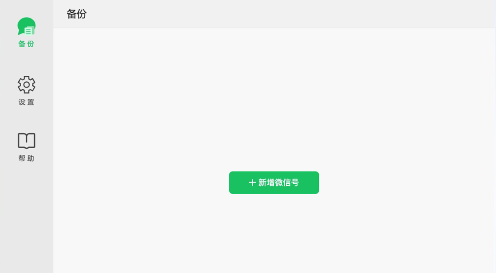

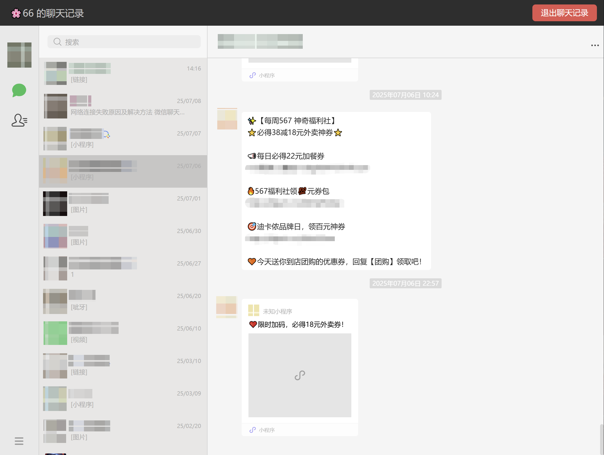


### 微备份（WxBackup）的优势

为什么不使用微信自带的备份功能呢？相比微信自带备份，微备份（WxBackup）的核心优势的体现在以下几点：

1. **访问方便**：界面简洁，操作方便，只需简单几步即可备份至Nas，可通过浏览器或其他Nas应用即可在电脑端、手机端查看聊天记录。
2. **支持Nas**：无需越狱、Root即可将聊天记录备份至Nas设备，目前已支持飞牛OS，后续会支持更多的主流平台。
3. **支持多账号**：支持多个微信账号备份聊天记录。
4. **离线查看**：在备份聊天记录后，可脱离微信登录依赖，即使微信未登录或账号被风控，也不影响查看已备份的聊天记录。
5. **数据安全**：备份的聊天记录仅存储在自己的Nas设备中，实现长久保存，备份后支持离线运行，且微备份（WxBackup）不会向任何其他平台传输数据。
6. **支持更多丰富的功能**：聊天记录可设置密码访问、导出数据（开发中）、聊天数据统计（开发中）、其他功能。

---


## 如何使用

**因目前仅支持飞牛OS，所以以下的所有使用教程均以飞牛OS、微备份Web端 为例，其他平台将会陆续更新。**


### 安装

#### 飞牛OS安装

1、飞牛系统版本需要在 **v0.9.35** 或以上

2、在 **[微备份（WxBackup）官网](http://www.wxbackup.com)** 下载保存微备份的安装包

3、安装：在 **应用中心** 左下方选择 **“手动安装”**，选择刚下载保存的微备份安装包进行安装

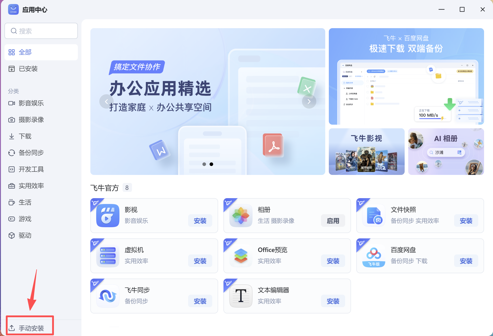

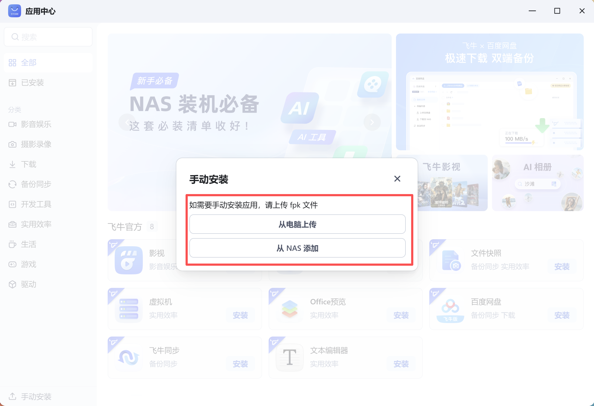


### 开始使用

#### 使用前必看（非常重要）

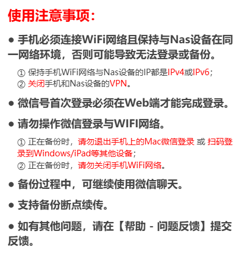


#### 登录

注意事项：

1、必须认真查看上述的**”使用前必看（非常重要）”**的内容后才能登录，否则可能出现登录失败的情况。

2、登录**新的微信号（或首次登录的微信号）**，都需在**电脑网页端的微备份（Web端）**进行操作，否则无法登录成功。


#### 备份

注意事项：

1、必须认真查看上述的**”使用前必看（非常重要）”**的内容后才能登录，否则可能出现备份失败的情况。

2、**备份时间可能会很长（聊天记录越多，备份时间越长），需要耐心等待，**最好选一个空闲的时间段进行备份。

3、**备份过程中，依然可以正常使用手机端微信。**

4、**需要保持手机端微信在前台（即保持微信处于打开状态），不能切换到后台，否则会备份失败。**

5、支持 **增量备份** 和 **备份断点续传**。


##### 开始备份

###### 备份设置

可根据自己的需求进行备份设置。

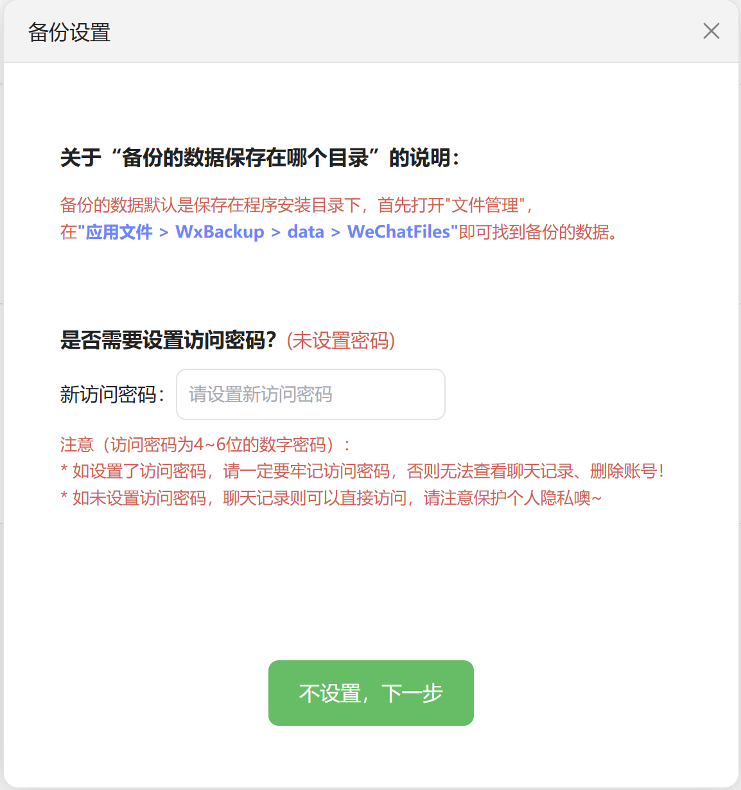

###### 开始备份

备份时长是由微信聊天记录大小决定，聊天记录越大，备份越慢。最好是选择一个空闲的时间段再进行备份。

以下是备份时的截图：

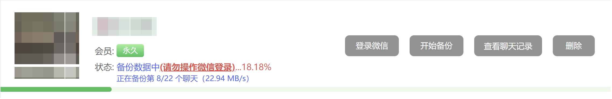

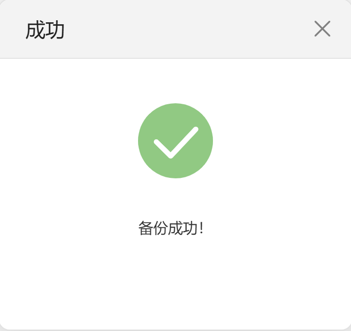

#### 查看聊天记录

###### 功能

目前聊天记录查看器支持的功能有：搜索聊天记录（可按日期、文件、图片、视频、链接、小程序、视频号、音乐与音频等类型进行搜索）、查看聊天记录、联系人（好友、群聊、公众号、企业微信联系人）、**统计**、**导出文件（目前仅支持Web端）**、**会话消息数**，还有一些功能正在开发中。


###### 消息类型

目前聊天查看器支持的消息类型如下：

- [x] 文本
- [x] 图片
- [x] 视频
- [x] 红包（仅支持“未被打开”的状态，不支持“已领取”、“已被抢完”等状态）
- [x] 系统消息（如“撤回“、”拍一拍”、“邀请某某入群”、“你被"xxx"移出群聊”等系统消息）
- [x] 名片
- [x] 小程序
- [x] 文件
- [x] 链接
- [x] 语音
- [x] wechat-emoji表情


以下消息类型正在开发中：

- [ ] 定位

- [ ] 转账

- [ ] 公众号通知（如“微信支付”、“腾讯新闻”等）

- [ ] 视频号分享

- [ ] 视频号直播

- [ ] 群内接龙

- [ ] 音乐分享

- [ ] 群公告

- [ ] 礼物

- [ ] 语音/视频通话

- [ ] GIF动图

- [ ] 合并消息

- [ ] 引用消息

- [ ] 其他消息类型正在完善中...

  

以下是消息类型的部分截图：

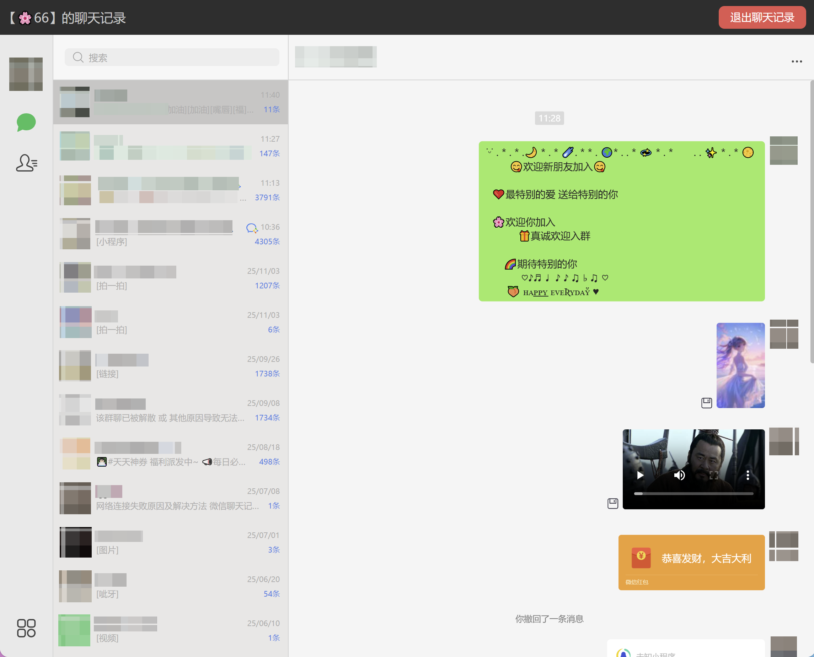

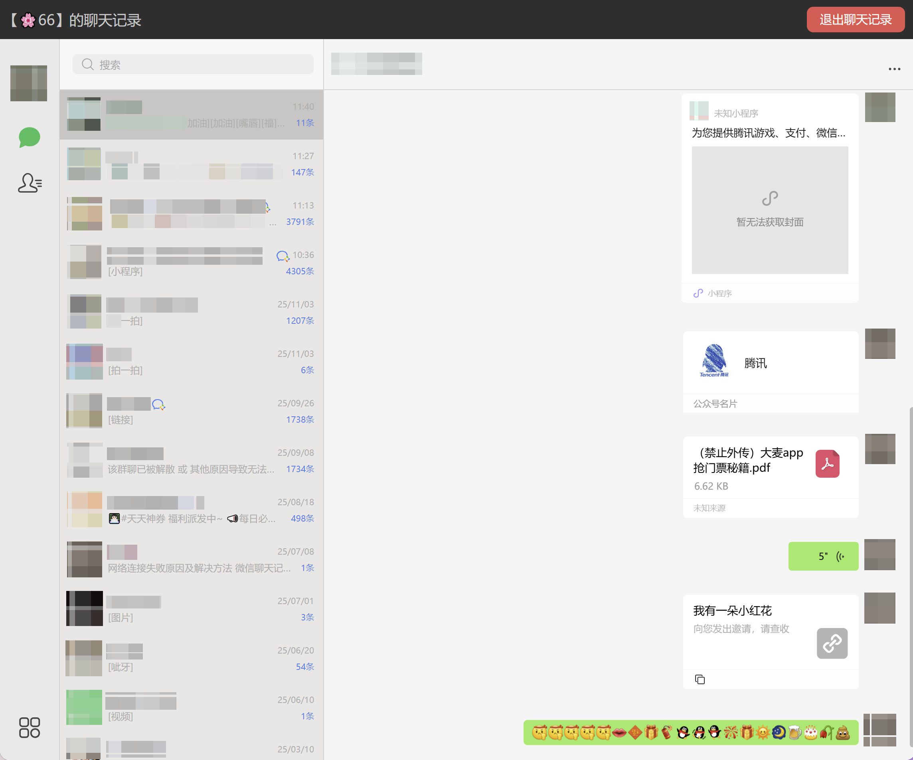

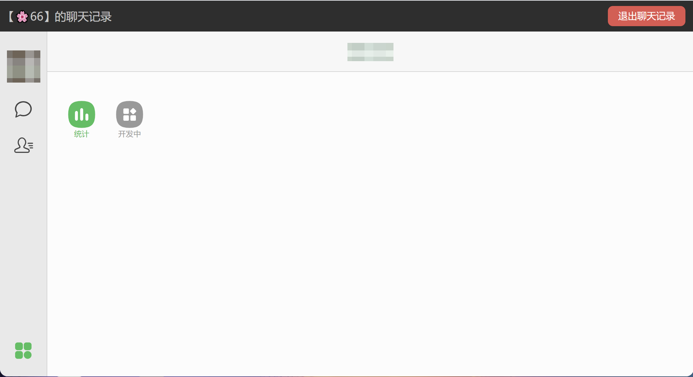


#### 删除

使用删除功能，会删除所有与微信号相关的信息，包括该账号的所有聊天信息，因此操作删除时，需谨慎！

* 如果设置了访问密码，删除时，会提示输入访问密码后才能删除；

* 如果未设置访问密码，则可以直接删除。

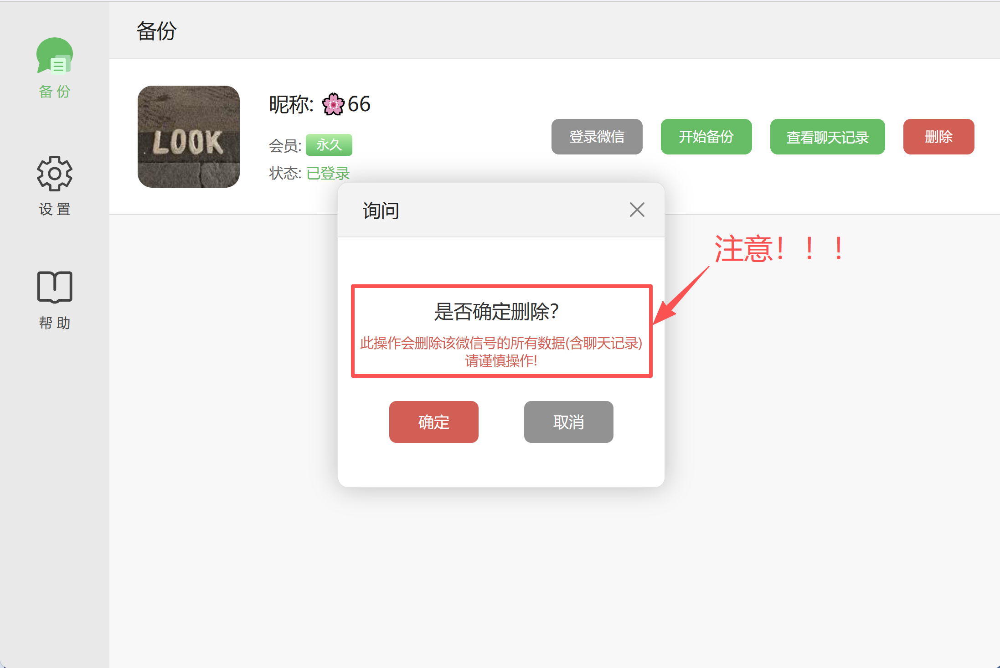


#### 设置

在设置页面可设置“访问密码”，但必须选中微信账号后，才能设置。（访问密码也可以在备份时设置，也可以在备份后在设置页面设置）

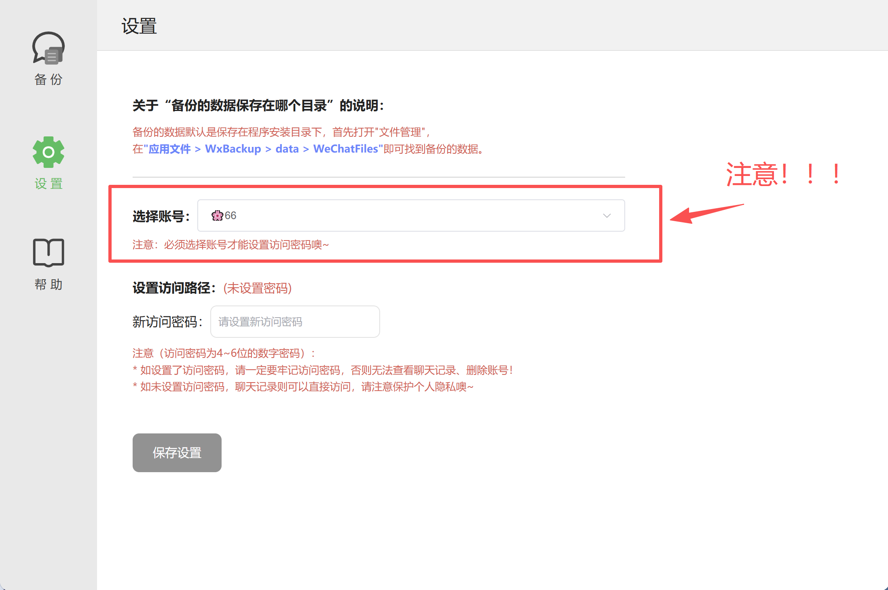


#### 帮助

###### 版本检测

**微备份** 支持下载更新，检测到有新版本后，可直接下载更新，更新完毕后，需手动重新运行 **微备份**。


###### 查看教程

文档中包含了大部分使用教程和常见问题（不断更新中...）


###### 联系方式

联系客服：**weibeifen@proton.me**


## 常见问题

### 为什么无法登录？

只有首次登录微信号或者新增微信号登录的时候，才需要在Web端微备份登录，且无法在H5端登录。首次登录过后，下次登录即可在H5端、Web端轻松登录了。首次登录或新增微信号登录，少部分用户可能还会因为本地网络环境复杂而出现微信安全验证，无需担心，只需在Web端上滑动滑块验证即可完成登录。


### 为什么无法备份？

无法备份，手机微信上会出现备份错误原因，Web端/H5端也会有错误原因。

大部分无法备份的原因如下：

1、未登录微信账号

2、手机（或其他苹果、安卓设备）未连接WiFi网络

3、手机（或其他苹果、安卓设备）与Nas设备不是连接同一个WiFi网络

4、手机或Nas设备开了VPN相关的工具

5、正在备份时，网络中断（断网、换WiFi、故障）

6、正在备份时，微信扫码登录到其他设备，或者微信退出登录了

7、其他原因，请联系客服


### 为什么第一次备份聊天记录需要这么久？

首次备份聊天记录必须要完整备份微信上的所有数据，此后，再备份均为增量备份，速度会快很多，同时备份时长又与聊天记录总数据大小、聊天记录的小文件多少、网络环境快慢、Nas设备配置高低等因素有关。


### 为什么备份会卡在100%就不动了？

首次完整备份时，可能会出现手机微信上卡在100%（0KB）的情况，这个时候是正在处理数据，需要等待一段时间才能完成。


### 聊天记录数据太大了，在Web端、H5端的浏览器访问会卡死吗？

无论是Web端还是H5端，还是其他平台的应用端都不会出现因数据太大而卡死的现象，我们在浏览聊天记录层面做了很多优化，目前是只有在数据量很大的情况下搜索聊天内容时，会较慢，这方面后续也会优化。


### 备份中断的话，会断点续传吗？

会的，备份过程中，如果中断了，下次备份时，会断点续传。


### 支持增量备份吗？

支持。首次备份较慢，后续备份则是增量备份，备份速度会快很多。


### 为什么有些视频、图片、语音无法打开？

具体有以下几个原因：

1、在备份聊天记录前，并未在手机微信上 点击查看该视频/图片/语音

2、该视频/图片/语音 在手机微信上已过期 

3、该视频/图片/语音 在手机微信上已被清理


### 为什么有些群成员头像、昵称无法显示？

如果发现群成员头像、昵称无法显示，请点击“刷新”按钮进行刷新。


### 如何恢复聊天记录？

可通过微信官方的PC端微信来恢复聊天记录。

可根据下图路径找到以下几个文件：

```
Backup.db
BAK_0_MEDIA
BAK_0_TEXT
BAK_1_MEDIA
BAK_1_TEXT
......
BAK_10_MEDIA
BAK_10_TEXT
```


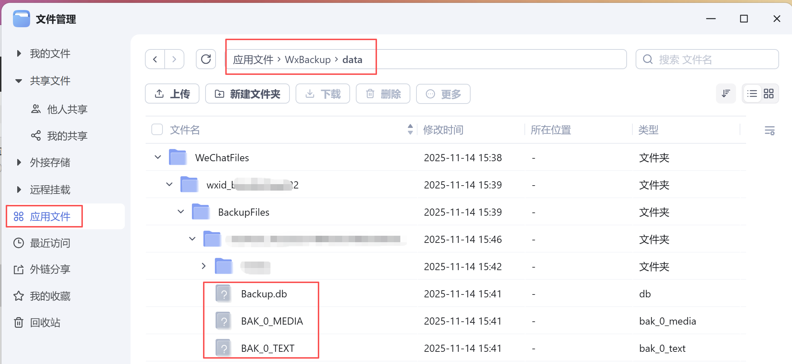


在微信官方微信PC端恢复的步骤如下图：


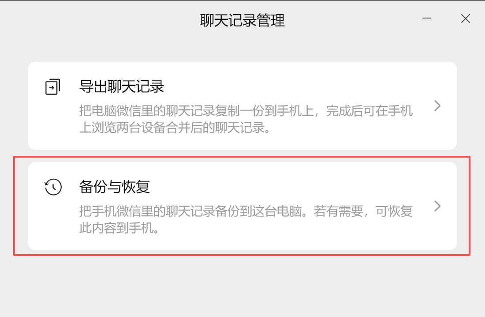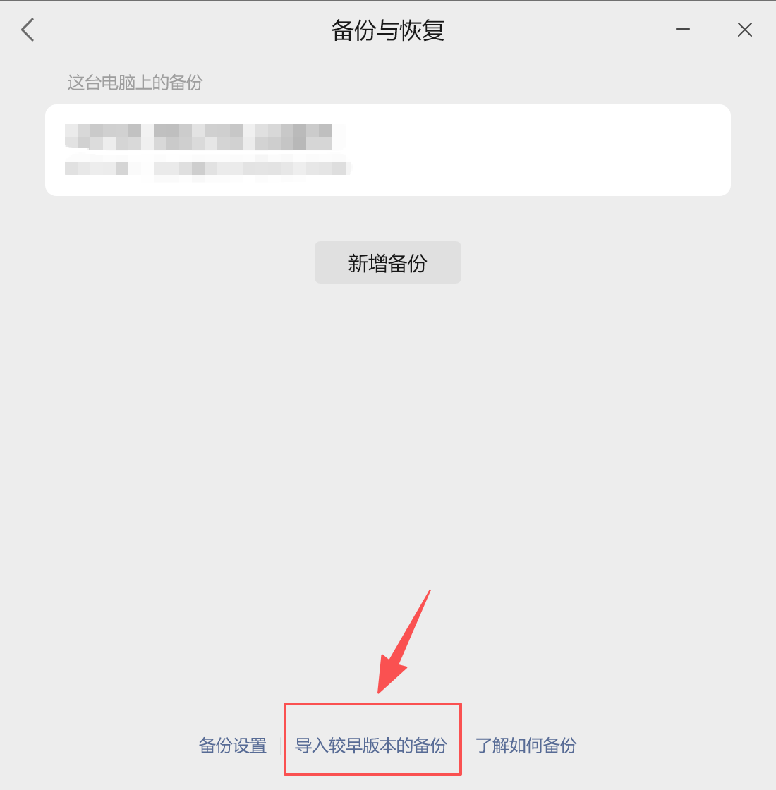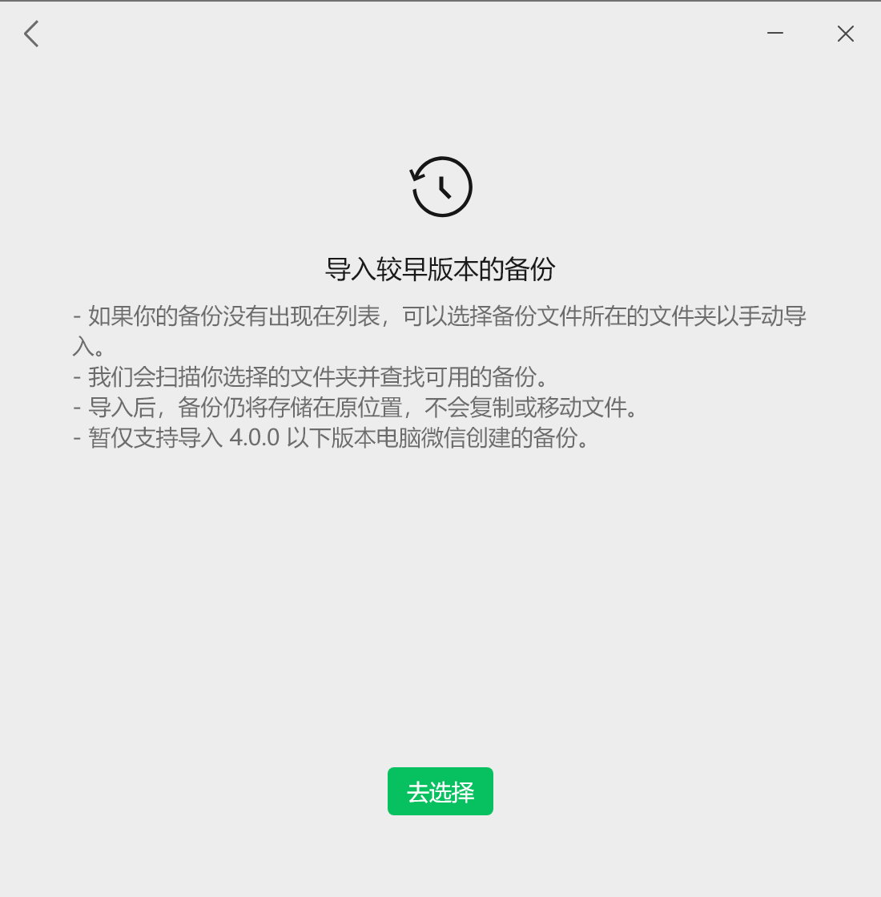


## 联系我们

如有任何使用上的问题、意见反馈，均可联系客服。

**联系客服：**weibeifen@proton.me


